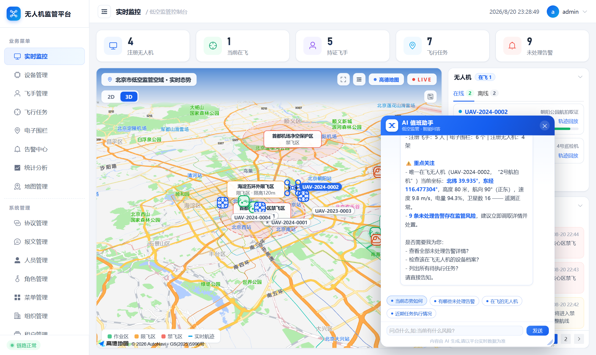
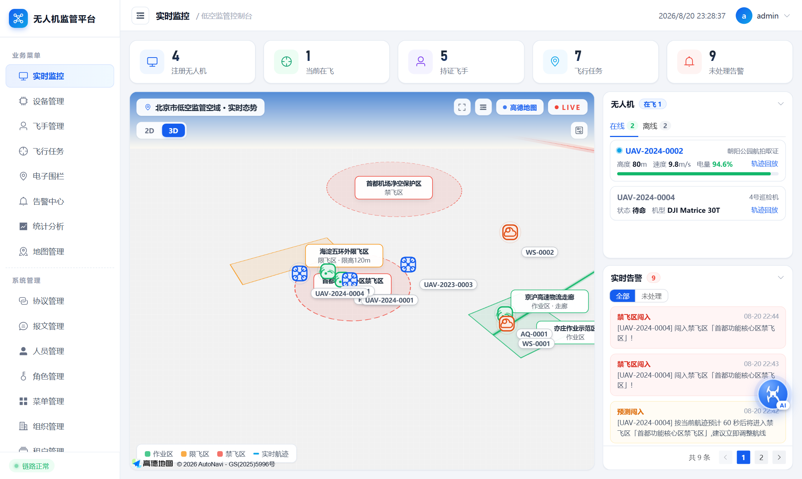
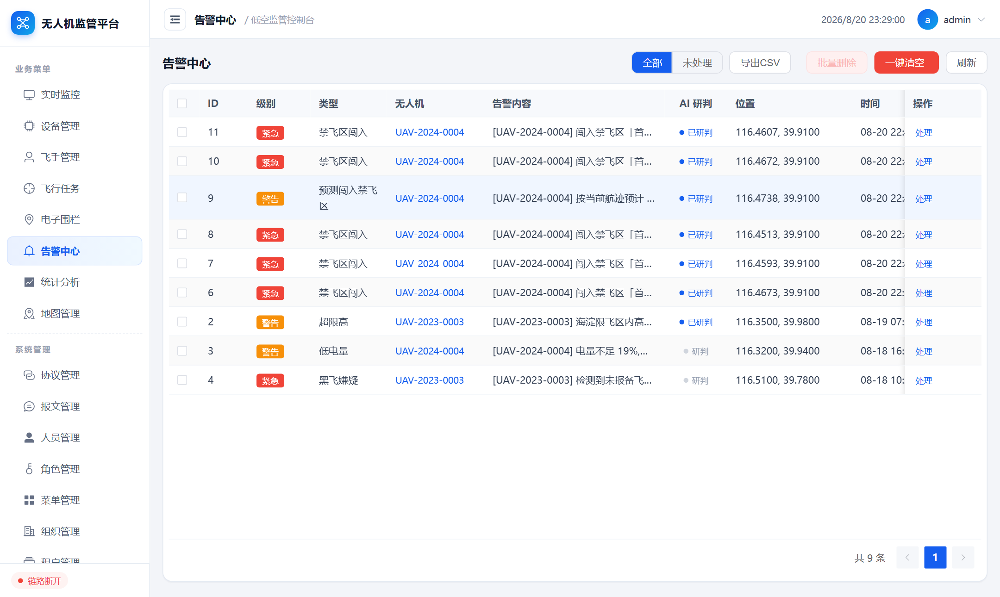
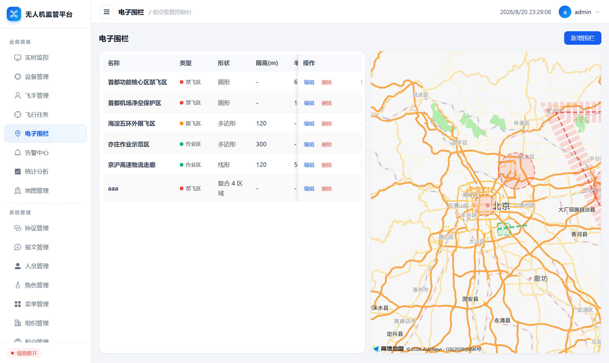
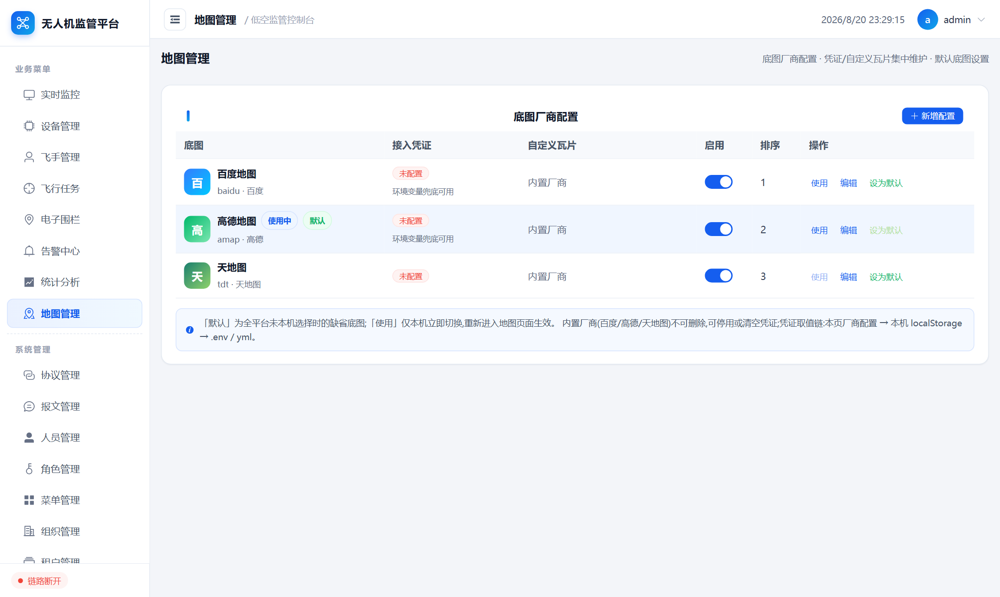

# 无人机低空监管平台

[English](README.md) | **简体中文**

面向政府监管场景的全栈**无人机低空监管平台**:实时地图监控、电子围栏、任务审批、告警处置、物联网设备接入,并内置 **AI 值班助手**(流式对话 + 平台数据工具调用、告警智能研判、态势日报)与**低空威胁感知**(预测闯入、多机冲突、遥测异常)。

技术栈:**Vue 3 + Spring Boot 3 + PostgreSQL/PostGIS**,可切换的**多引擎地图层**(百度 / 高德 / 天地图 / 自定义瓦片),内置**飞行模拟引擎**与 **Netty 设备接入网关**(标准二进制帧 / DTU 串口透传 / Modbus TCP)。开箱即可体验完整的「任务审批 → 起飞 → 实时态势 → 告警处置」与「物联网设备接入 → 协议解析 → 历史数据」闭环。

---

## 系统截图

| | |
|---|---|
|  |  |
| **实时监控 + AI 值班助手**——无人机图标、航迹、电子围栏,右侧告警/无人机/传感器/视频四面板,无人机样式 AI 悬浮球流式回复 | **实时监控**——多引擎底图、无人机位置航向、航迹线、可收缩面板、地图工具箱(测距/鹰眼/3D罗盘/全屏) |
|  |  |
| **统计分析**——近7日趋势、告警类型、机型分布、飞手排行(ECharts 亮蓝政务风) | **告警中心**——分页、分级、处理闭环、AI 研判列 |
|  |  |
| **飞行任务**——创建、审批流、下发起飞/中止、地图选点航线 | **电子围栏**——禁飞/限飞/作业区,圆/线/面地图可视化绘制 |
|  |  |
| **设备管理**——七类设备、自定义地图图标、历史曲线 | **地图管理**——四类底图引擎密钥服务端统一管理 |
|  |  |
| **模型配置**——OpenAI 兼容接口,密钥仅存服务端(接口脱敏) | **登录**——验证码 + token 鉴权 |

## 功能总览

| 模块 | 说明 |
|------|------|
| 实时监控大屏 | 多引擎底图,无人机图标实时位置与航向、航迹线、电子围栏渲染(圆/线/面);右侧 **实时告警(分页)/ 无人机(在线·离线双 TAB)/ 物联传感器 / 视频监控** 四面板均可上下收缩,整栏亦可一键收起(地图占满);地图支持 **一键全屏**(Esc 退出);无人机均支持 **轨迹回放**(时间轴拖动/倍速;在飞=实时入库,离线=近 3 天历史);地图展示全部设备 ICON(**优先渲染「设备管理」配置的自定义图标**),点击查看基础信息 + 近 60 分钟历史曲线;右上角 **地图工具箱**:比例尺 / 底图工具条 / 方向盘平移 / 自绘鹰眼缩略图 / 3D 罗盘 / 测距 / 面积测算(跨引擎一致,开关状态本地记忆) |
| **地图管理** | 底图提供商 **服务端统一管理**:维护各厂商 AK/KEY/密钥、渐变色样式、排序,支持 **百度 / 高德 / 天地图 / 自定义 XYZ 瓦片** 四类厂商,可设默认图源、启停切换 |
| 无人机管理 | 档案 CRUD、状态机(待命/飞行/充电/维保/离线)、飞手绑定、归航点 |
| 飞手管理 | 执照档案 CRUD、有效期管理、飞行时长统计 |
| 飞行任务 | 任务创建、审批流(批准/驳回)、下发起飞、中止、地图选点航线 |
| 电子围栏 | 禁飞区/限飞区/作业区,**圆形/线形/多边形** 三种形态;**全屏地图可视化绘制**(单击加点/移动预览/双击完成,圆心两次点击定半径,可撤销清空),底图上淡显已有围栏作参考,不依赖各厂商 DrawingManager,四引擎交互完全一致;空间数据以 **WGS-84(4326) geometry 字段**(Point/LineString/Polygon)存储并建 GiST 索引,接口侧自动转换 BD-09;提供点包含判定接口 |
| **协议管理** | 设备协议 CRUD + **解析测试**:支持 **TLV(tag/length/value,长度与字节序可配)**、**定长偏移切片(FIXED)**、**Modbus 寄存器映射** 三种帧格式;数值支持 **二/八/十/十六进制** 与有符号/缩放/字节序换算 |
| **设备接入** | 无人机/机巢/摄像头/气象站/ADS-B/网关/传感器 七类设备档案,**支持自定义地图图标**(上传 PNG/SVG);虚拟设备由内置模拟器供数,真实设备经 **Netty 网关** 三端口接入;上报数据入库留存(每设备保留最近 2000 条)并经 WebSocket 实时推送;飞行遥测每 4s 入库 |
| **视频监控** | 摄像头设备配置 HLS(m3u8) 地址即可实时播放:服务端 `/api/video/proxy` 代理拉流(自动跟随 302 临时 token、改写播放列表分片地址,解决浏览器 CORS);hls.js 解码,Safari 原生 HLS 兜底;种子数据内置 4 路公网可看的实时流 |
| 告警中心 | 禁飞区闯入、超高、低电量、失联、无证飞行、任务超期 **+ 下列威胁感知新类型**;分级(紧急/警告),处理闭环,分页查询 |
| 统计分析 | 近7日趋势、机型分布、告警类型、飞手排行(ECharts) |
| **AI 能力** | 见下节 |
| 登录与后台 | 验证码登录、Bearer 鉴权、操作日志切面;人员/角色/菜单/组织/租户/日志管理 |

## AI 能力

LLM 功能基于任意 **OpenAI 兼容对话接口**(以通义千问 Qwen 的 DashScope compatible-mode 开发验证)。API Key 推荐放在 `backend/.env`(复制 `backend/.env.example` 填写 `LLM_API_KEY`,该文件已被 gitignore);「模型配置」页保存的密钥优先级更高。密钥**不进代码仓库**,接口返回一律脱敏(`******`)。

| 功能 | 说明 |
|------|------|
| **AI 值班助手** | 监控页无人机样式悬浮球,点击弹出可拖动/可调大小的对话窗口;回复 **SSE 流式逐字输出**,模型可调用 **6 个平台工具**(`get_overview` / `list_flying` / `list_alerts` / `list_tasks` / `get_device` / `list_fences`)多轮函数调用——回答基于平台实时数据,查询过程中显示工具状态 |
| **告警智能研判** | 每条新告警提交后异步研判(告警页亦可按需触发),风险分析 + 处置建议写回告警记录 |
| **态势日报** | 定时(默认每日 07:36)生成近 24h 态势日报(markdown)并推送站内信,支持手动生成 |
| **威胁感知(预测预警)** | 传统算法实时判断(LLM 不进实时环路):60s 轨迹外推 → **预测闯入 PREDICTED_BREACH**(带预计到达时间);CPA/DCPA/TCPA 会遇数学 → 多机 **冲突告警**;异常窗口 → **电量骤降 / 高度突变 / 信号弱**。阈值全部可在 `application.yml` 配置 |

```yaml
# backend/src/main/resources/application.yml
ai:
  api-key: ${LLM_API_KEY:}      # 密钥回落,取自 backend/.env
  enabled: true
  alert-assess: true            # 告警产生后自动异步研判
  report-cron: "0 36 7 * * *"   # 态势日报
threat:
  horizon-seconds: 60           # 轨迹外推时长
  conflict-dcpa-meters: 100     # 多机最近会遇距离阈值
  conflict-tcpa-seconds: 60
  battery-drop-percent: 15      # 电量骤降阈值(窗口内)
  altitude-jump-meters: 40
  min-satellites: 6
```

## 技术栈与架构

- **前端** `frontend/` — Vue 3(script setup)· Vite 5 · Element Plus · ECharts · 多引擎地图适配层(vite 代理 `/api` `/ws`)
- **后端** `backend/` — Spring Boot 3.5 · Java 17+ · Spring Data JPA · **PostgreSQL 16 + PostGIS 3.4(Docker)** · hibernate-spatial(JTS)· WebSocket(遥测/告警推送)· **Netty TCP 网关** · SSE 流式
- **地图适配层** — `mapAdapter.js` 统一封装百度 GL / 高德 JS API 2.0 / 天地图 4.0 / 自定义 XYZ 瓦片,`coord.js` 负责 BD-09 / GCJ-02 / WGS-84 坐标互转;业务代码只面向统一 API 与 BD-09 坐标,切换底图零改动
- **模拟引擎** — 2 秒一 tick:无人机沿航线飞行、电量消耗、卫星数抖动、围栏碰撞检测(射线法/大圆距离)、告警冷却去重(同类 60s)、WS 广播;另有 IoT 模拟器(5 秒一 tick)为机巢/摄像头/气象站/ADS-B/网关/传感器等虚拟设备供数

```
┌─ Vue 3 SPA ───────────────────────────────────────────────┐
│  监控 / 任务 / 围栏 / 告警 / 统计 / 后台管理页面            │
│  地图适配层(百度·高德·天地图·XYZ)   AI 值班助手悬浮球      │
└──────┬───────────────┬────────────────┬───────────────────┘
       │ REST /api     │ WS /ws         │ SSE /api/ai/*
┌──────▼───────────────▼────────────────▼───────────────────┐
│                Spring Boot 3 (端口 8180)                    │
│  认证(验证码+token)· 任务 · 围栏 · 告警 · 统计              │
│  设备/协议管理 · 视频代理 · 地图提供商管理                  │
│  AiAssistantService ── LlmService ──► OpenAI 兼容接口       │
│  ThreatService(预测/冲突/异常,毫秒级)                     │
│  FlightSimulator / IoT 模拟器(虚拟设备)                    │
│  Netty 网关:9527 TLV · 9528 DTU · 9529 Modbus TCP          │
└──────┬─────────────────────────────────────────────────────┘
       │ JPA / hibernate-spatial
┌──────▼─────────────────────────────────────────────────────┐
│         PostgreSQL 16 + PostGIS 3.4(geometry, GiST)        │
└─────────────────────────────────────────────────────────────┘
```

## 快速启动

```bash
# 1. 启动 PostgreSQL + PostGIS(必须先就绪,首启自动建表+种子数据)
docker run -d --name wrj-postgres \
  -e POSTGRES_DB=wrj -e POSTGRES_USER=wrj -e POSTGRES_PASSWORD=wrj123 \
  -p 5432:5432 postgis/postgis:16-3.4

# 2. 后端(端口 8180,需 JDK 17+ 与 Maven;网关端口 9527/9528/9529)
cd backend
mvn spring-boot:run

# 3. 前端(端口 5174)
cd frontend
npm install
npm run dev
```

访问 **http://localhost:5174**,登录账号 **admin / admin123**。

> 地图密钥推荐登录后在「地图管理」页维护(服务端持久化);
> 也可用环境变量为后端提供回落值(`MAP_BAIDU_AK / MAP_AMAP_KEY / MAP_AMAP_SEC / MAP_TDT_KEY`,可写在 `backend/.env`)。
> LLM:复制 `backend/.env.example` 为 `backend/.env` 并填入 `LLM_API_KEY`(base URL / 模型代号在「模型配置」页维护,页内保存的密钥优先于环境变量)。不配置也不影响平台其它功能,仅 AI 功能不可用。

### 地图密钥说明

| 提供商 | 申请地址 | 配置方式 |
|--------|----------|----------|
| 百度地图 | https://lbsyun.baidu.com | 「地图管理」页编辑该厂商填入 AK(默认图源) |
| 高德地图 | https://console.amap.com | 「地图管理」页填入 KEY + 安全密钥 |
| 天地图 | https://console.tianditu.gov.cn | 「地图管理」页填入 TK |
| 自定义瓦片 | 自建瓦片服务 | 「地图管理」新增 CUSTOM 厂商,填瓦片 URL 模板并选引擎 |

> 密钥保存在服务端 `sys_map_provider` 表与浏览器 localStorage 回落中,**不会进入代码仓库**。

## 设备接入网关(Netty)

| 端口 | 通道 | 适用 |
|------|------|------|
| **9527** | 标准 AA55 魔数 + CRC16 + **TLV** 二进制帧 | 无人机/机巢等标准设备 |
| **9528** | DTU 串口透传(RS232/RS485),`REG:/PING:/DATA:<进制>:` 文本行协议 | 串口传感器,载荷支持二/八/十/十六进制 |
| **9529** | **Modbus TCP**(MBAP + FC03/04/10) | PLC 等 Modbus 设备,FC16 写寄存器即入库 |

三种通道上报的数据统一走「协议管理」配置的解析规则(TLV / 定长偏移 / 寄存器映射)拆出业务字段,入库留存(每设备保留最近 2000 条)并经 WS 实时推送。

## 设备模拟器(backend/scripts/)

```bash
# 标准帧接入 9527(无人机遥测 TLV)
node device-simulator.mjs --code UAV-2024-0002 --secret secret-0002 --protocol drone

# DTU 串口透传接入 9528(RS485 环境微站,定长帧 hex 上报)
node device-simulator.mjs --mode transparent --code AQ-0001 --secret secret-aq01

# Modbus TCP PLC 接入 9529(FC16 周期写寄存器 0-3)
node device-simulator.mjs --mode modbus --unit 1
```

可选参数:`--interval ms`(上报周期,默认 3000)`--host` `--port`。

## 主要接口

```
POST /api/auth/login                     登录(用户名/密码/验证码)
GET  /api/auth/captcha                   SVG 验证码
GET  /api/drones|pilots|tasks|devices|protocols   列表
POST /api/tasks/{id}/approve             审批(approved/rejected)
POST /api/tasks/{id}/launch              下发起飞(启动模拟)
POST /api/tasks/{id}/abort               中止
GET  /api/alerts?page&size&unhandled     告警分页
POST /api/alerts/{id}/handle             处理告警
GET  /api/stats/{overview|trend|alert-type|drone-model|pilot-rank}
GET|POST|PUT|DELETE /api/map-providers   底图提供商管理
PUT  /api/map-providers/{id}/default     设为默认图源
GET  /api/fences/contains?lng&lat        点是否落入启用围栏(WGS-84)
GET  /api/devices/{id}/history?minutes&limit   设备历史上报(供回放)
GET  /api/devices/latest-data            全部设备最新一帧遥测
GET  /api/video/proxy?url=<m3u8>         HLS 视频流代理(跟随重定向+改写分片)
POST /api/protocols/{id}/parse           协议解析测试
POST /api/ai/copilot                     AI 值班助手(阻塞)
POST /api/ai/copilot/stream              AI 值班助手(SSE 流式)
POST /api/ai/alert/{id}/assess           告警按需研判
POST /api/ai/report/generate             生成态势日报
WS   /ws/telemetry                       实时推送 {type, payload, ts}
                                         # telemetry | alert | deviceData | deviceStatus
```

## 项目结构

```
├── backend/                        # Spring Boot 后端
│   ├── .env.example                # 环境变量模板:LLM_API_KEY + MAP_* 回落密钥
│   ├── scripts/                    # 零依赖工具脚本
│   │   ├── device-simulator.mjs    # 设备接入模拟器(三模式)
│   │   ├── probe-register.mjs      # 注册探测
│   │   └── smoke-test.sh           # 冒烟测试(登录→业务接口→WS)
│   ├── sql/init/                   # PostGIS 扩展初始化
│   └── src/main/java/com/wrj/platform/
│       ├── controller/             # REST 接口(设备/协议/地图/围栏/告警/AI...)
│       ├── service/                # 业务、飞行模拟引擎、协议解析、AI 助手/LLM/威胁感知
│       ├── gateway/                # Netty 接入网关(9527/9528/9529 三端口)
│       ├── entity|repository/      # JPA 实体与仓储(围栏含 PostGIS geometry)
│       └── config/                 # 种子数据 / WebSocket / Schema 初始化
└── frontend/                       # Vue 3 前端
    └── src/
        ├── views/                  # 页面(监控/任务/围栏/告警/统计/后台...)
        ├── components/             # 监控面板、AI 悬浮球等
        ├── utils/
        │   ├── mapAdapter.js       # 统一地图适配层(四引擎)
        │   ├── mapProviders.js     # 提供商注册表 + SDK 按需加载
        │   ├── coord.js            # 坐标系互转(BD-09/GCJ-02/WGS-84)
        │   └── map.js              # 设备图标 SVG 生成
        └── api/                    # axios 封装
```

## 体验路径

1. 登录 → **实时监控**:地图上可见围栏、机巢与各在线设备 ICON,点击 ICON 查看基础信息与历史曲线;右侧四个面板可收缩,顶栏可整栏收起右栏 / 地图全屏(Esc 退出)
2. **飞行任务** → 找到已批准任务 → 「下发起飞」(演示库 1/2 号机在线可飞)
3. 回到 **实时监控**:无人机图标沿航线移动、航迹渐显;点开右下角 **AI 悬浮球** 问「当前态势如何」——助手查实时数据并流式作答;无人机面板任一机型「轨迹回放」按时间轴重放
4. 任务 1(东城河道巡检)航线穿过核心区禁飞区——约 1 分钟内触发「禁飞区闯入」紧急告警(每 60s 重复提醒),此前还会有 **预测闯入** 预警;数秒内告警自动附带 AI 研判结论
5. **协议管理** → 任一协议「解析测试」:粘贴二/八/十六进制报文即时查看字段拆分结果
6. **设备管理** → 查看七类物联网设备;配合模拟器脚本体验真实 TCP 接入
7. **告警中心** 处理告警;**统计分析** 查看图表;**地图管理** 切换四类底图对比体验
